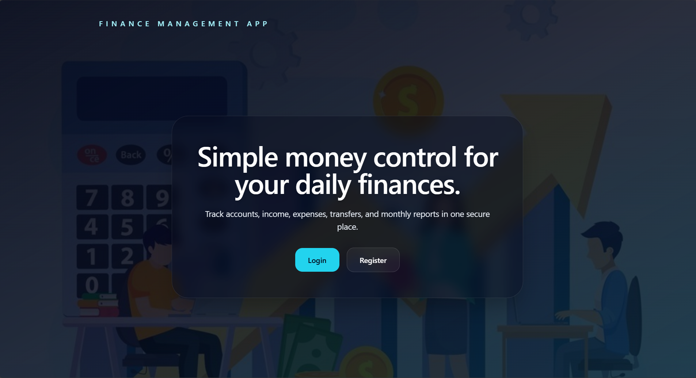
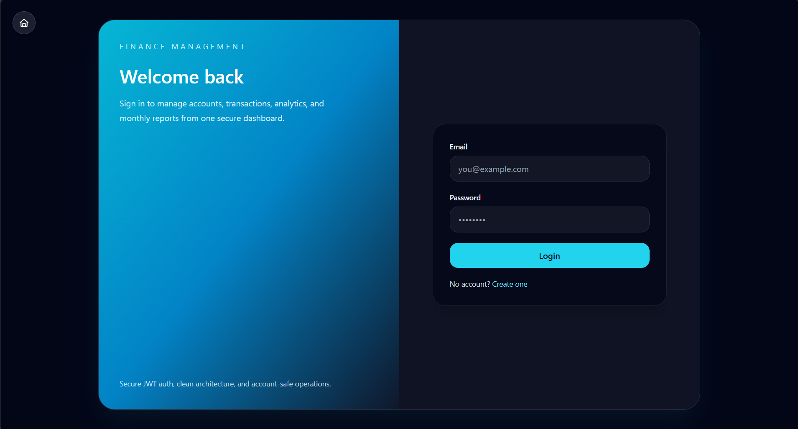
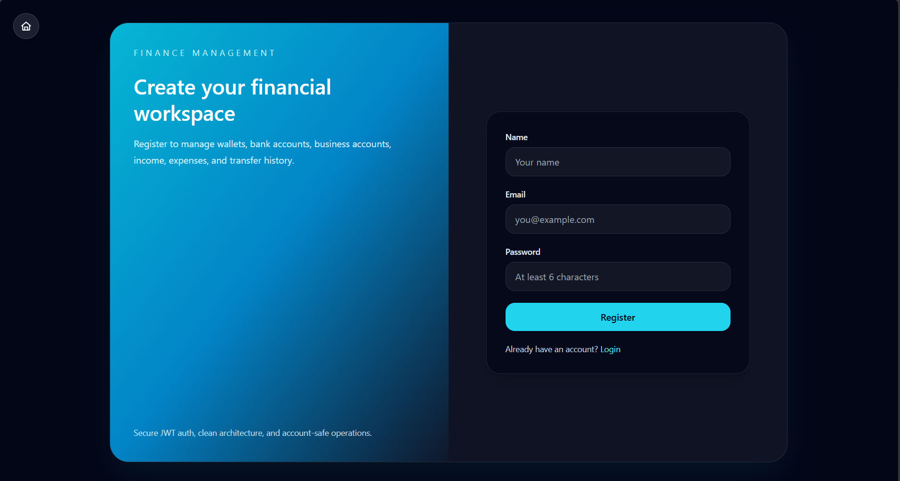
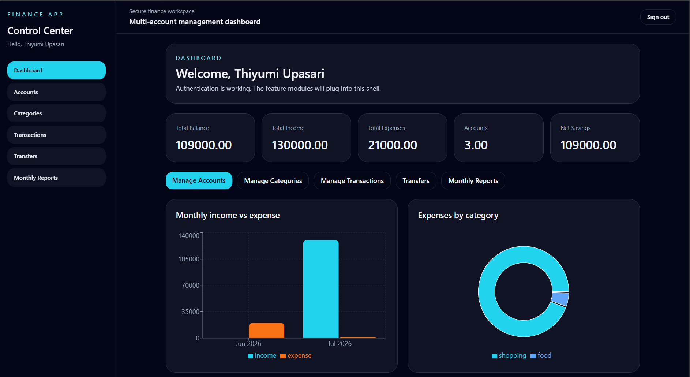
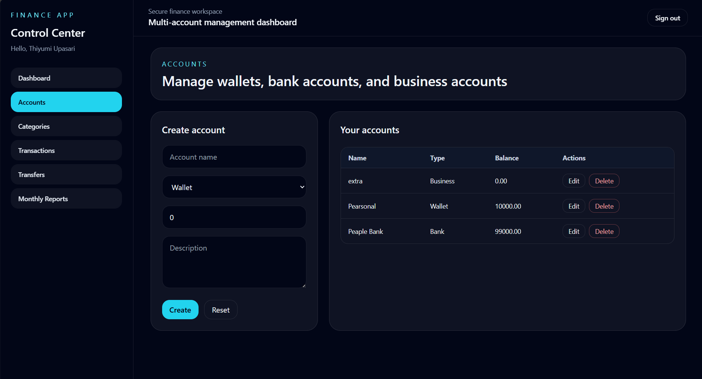
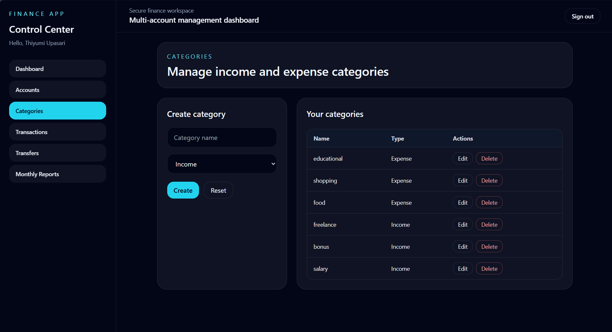
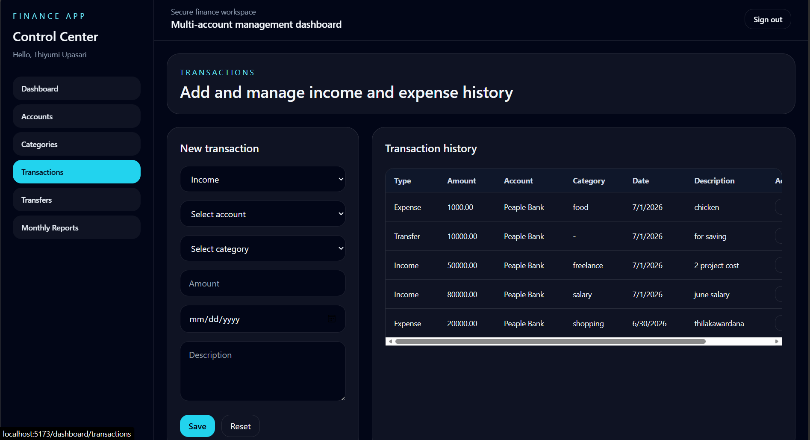
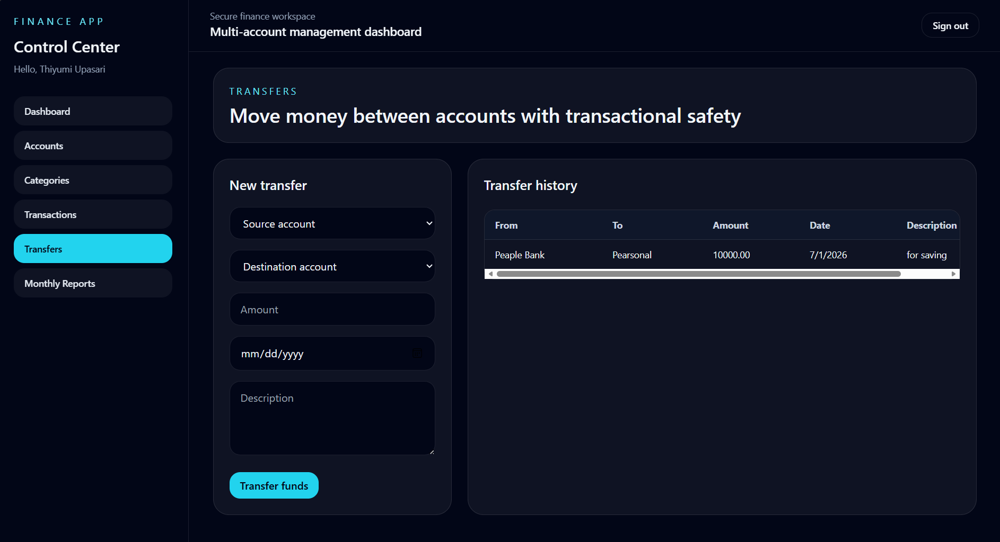
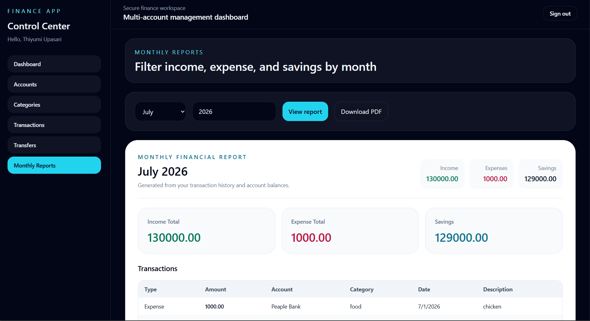

# Finance Management Application

Modern MERN-based personal finance management app with authentication, multi-account support, transactions, transfers, analytics, and monthly reports.

## Screenshots

### Public Pages

<table>
   <tr>
      <td align="center">
         
         <br />Home page
      </td>
      <td align="center">
         
         <br />Login page
      </td>
   </tr>
   <tr>
      <td align="center">
         
         <br />Register page
      </td>
      <td></td>
   </tr>
</table>

### Dashboard And Management

<table>
   <tr>
      <td align="center">
         
         <br />Dashboard page
      </td>
      <td align="center">
         
         <br />Accounts page
      </td>
   </tr>
   <tr>
      <td align="center">
         
         <br />Categories page
      </td>
      <td align="center">
         
         <br />Transactions page
      </td>
   </tr>
   <tr>
      <td align="center">
         
         <br />Transfers page
      </td>
      <td align="center">
         
         <br />Monthly report page
      </td>
   </tr>
</table>

## Tech Stack

- Frontend: React, Vite, React Router DOM, Axios, Tailwind CSS, Recharts
- Backend: Node.js, Express.js, JWT, bcrypt.js, Mongoose
- Database: MongoDB Atlas

## Features

- User registration and login
- Protected dashboard routes
- Account management for wallet, bank, and business accounts
- Income, expense, and transfer management
- Category management
- Dashboard analytics and monthly reports
- Print-friendly monthly report view

## Setup

1. Install dependencies:

   ```bash
   npm install
   ```

2. Create `backend/.env` with your Atlas URI:

   ```env
   PORT=5000
   MONGODB_URI=your-mongodb-atlas-connection-string
   JWT_SECRET=your-secret
   NODE_ENV=development
   ```

3. Start the backend:

   ```bash
   npm start --workspace backend
   ```

4. Start the frontend:

   ```bash
   npm run dev --workspace frontend
   ```
## Live Demo

### Frontend (Vercel)
https://finance-management-application-fron.vercel.app/

### Backend API (Render)
https://finance-management-application-wjq0.onrender.com/api

### Health Check
https://finance-management-application-wjq0.onrender.com/health


## Environment Variables

### Backend (.env)

```env
PORT=5000
MONGODB_URI=your_mongodb_atlas_connection_string
JWT_SECRET=your_jwt_secret
NODE_ENV=production
```

### Frontend (.env)

```env
VITE_API_URL=https://finance-management-application-wjq0.onrender.com/api
```


## Deployment

- **Frontend:** Vercel
- **Backend:** Render
- **Database:** MongoDB Atlas (Cluster0)


## Future Improvements

- Email verification
- Password reset functionality
- Budget planning and spending limits
- Multi-currency support
- Dark mode
- Mobile responsive improvements
- Notifications and reminders


## Notes

- The landing page is the default entry point.
- Authenticated routes are grouped under `/dashboard`.
- The monthly report view is designed to print cleanly.

## Author

**Thiyumi Upasari**

Undergraduate | Full Stack Developer

GitHub: https://github.com/Thiyumi2003

LinkedIn: https://www.linkedin.com/in/thiyumi-upasari